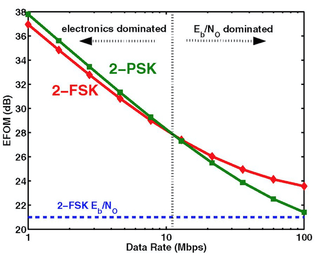

### Fundamental Capabilities of IoT Systems
#### Requirements and Tradeoffs

Ravi Pappu

Chief Architect, InQTel

> Disclaimer: This presentation contains only my opinions. I am not representing the opinions or positions of my employer or any agency related to my employer.

---
## Four Big Ideas

+++
## 1. Software representations of things

>Anything that can be represented by software _will_ be represented by software...separating the logical content of objects from their physical representation – cleaving the bits from the atoms.

+++
## 2. Invisible technology

> The most profound technologies are those that disappear. They weave themselves into the fabric of everyday life until they are indistinguishable from it. - Marc Weiser

+++
## 3. Measurement, measurement, measurement

> Software is eating the world, but the world can’t eat software. Some of the largest challenges facing our species cannot be solved by code; we cannot program away climate change, water contamination, crowded cities, or hunger. 

+++
## 4. Recombinant technology capabilities

>The more technology artifacts we have, the more we will have, owing to the power of recombination. Engineering relies on the encapsulation of discrete capabilities into modular artifacts that can then be combined to create new artifacts, which can themselves be modularized, and so on.

---
## Definition
>The Internet of Things makes the physical world amenable to computation. 

+++
## Dominant paradigm

+++
## Fundamental Capabilities 

1. Communication
2. Hardware
3. Software
5. Management
6. Security
6. Analytics

_Sensing and Power are also core capabilities. I chose to omit them here because they are very domain-specific._
--- 
## Communication

+++
### Exercise

+++ 
### IoT Comms Requirements
1. Low cost
2. Long range 
3. Long operating times i.e., low power consumption
4. High concurrency
5. Efficiency: optimized for short data payloads (IPv6 won't work)
6. Mobility
7. In-building penetration
8. Bi-directional communication
9. Global license-free operation

+++
### Governing Equations
Shannon Capacity 

$$C (b/s/Hz) = B\log_{2}(1+\frac{S}{N})$$

Friis Propagation 

$$P\_{rec} = P\_{xmit} G\_{xmit} G\_{rec} \frac{(\lambda)^2}{(4 \pi r)^2}$$ 

+++
### Energy of Electronics vs. Commmunication

 
Sodini and Wang, On the energy efficiency of wireless transceivers 

+++ 
### Data Rate vs. Range

+++

### Communications Tradeoffs
1. Range vs. Power
2. Directionality vs. Size or Cost
3. Bandwidth vs. Power
4. Data rate vs. Cost
5. Computing vs. Communication

+++
### Communication Stack

+++
### Communication Landscape

---
## Hardware
> Includes 4 major subsystems: Computing, Communication, Storage, and Analog-to-Digital conversion

+++
### Hardware requirements
1. Smaller, faster, thinner, lighter
2. Low power consumption
  * There's no Moore's Law for energy storage. IoT power improvements need to focus on improving the efficiency of processor, memory, ADC, and radios.
  * Battery capacity is proportional to volume. Longer life implies bigger devices.
3. Adaptability - Rapid prototyping and fast development cycles should be supported
4. Multiple hardware interfaces should be supported.
+++
### CPU Power Consumption
Total Power Consumption

$$P\_{total} = P\_{dyn.} + P\_{sc} + P\_{leakage}$$

Dynamic power

$$P_d = CV^2f$$ 
+++
### Make vs. Buy
 <!-- .element: class="fragment" -->

> Premature optimization is the root of all evil - Donald Knuth <!-- .element: class="fragment" -->
+++
### Early customers won't pay for...
1. How complex your hardware supply chain is <!-- .element: class="fragment" -->
2. How hard you had to work to screenprint your 3-color logo on the case. <!-- .element: class="fragment" -->
3. The 55 different types of fasteners you have in your assembly. <!-- .element: class="fragment" -->
4. An expensive custom-colored micro-USB cable. <!-- .element: class="fragment" -->
5. 72.5 iterations of your product design from a highly-rated ID firm. <!-- .element: class="fragment" -->
---
## Software

+++
### OS requirements
1. Resources: should work in low-power and resource constrained environments <!-- .element: class="fragment" -->
2. Scalability: Should be able to run on a wide variety of hardware platforms <!-- .element: class="fragment" -->
3. Modularity: Should be able to select only those components relevant to the application <!-- .element: class="fragment" -->
4. Connectivity: Availability of standard wired and wireless networking stacks <!-- .element: class="fragment" -->
5. Reliability: If needed, the OS must provide real-time guarantees <!-- .element: class="fragment" -->
6. ??? <!-- .element: class="fragment" -->
+++
### OS Choices
Two approaches - top-down and bottom-up

> IoT-specific OSes - RIOT, Contiki, TinyOS, ROS

> General-purpose OSes - Linux, Android, Brillo, etc

> Full-stack platforms - mBed, AWS IoT etc.
+++
### A new approach - platformio.org

+++
### A new approach - platformio.org

---
## Management

> Managing involves Provisioning, Controlling, Updating, Logging and Monitoring IoT networks

+++
### Requirements for Managing IoT
1. Resources: Constrained Nodes which cannot implement complex management protocols <!-- .element: class="fragment" -->
2. Scale: Support for thousands of nodes <!-- .element: class="fragment" -->
3. Occasionally connected: Nodes can be powered down or go out of range at any time <!-- .element: class="fragment" -->
4. No downtime: Managing activities might need to take place while the device is operational <!-- .element: class="fragment" -->
5. High cost of failure: Failures might cause the Node to be “bricked”, leading to expensive recalls <!-- .element: class="fragment" -->

+++?image=assets/switchboard.jpg

---
## Security

Securing IoT Nodes comprises:
 > Data integrity
 > Authentication/authorization
 > Confidentiality

+++
### Challenges for IoT security
1. Usually absent: No motivation for security by design
2. Budget: No cost budget for security because of need for low-cost Nodes
3. Constrained resources: Constrained hardware and software environments not conducive to security
4. Remoteness: Physical security is impossible in unmanned or distant Nodes
5. Weak links: Patchwork of systems increases attack surface
6. Skills: Deployed by non-IT staff with no background in cyber-security

+++?image=assets/iot-security.jpg

---
## Analytics

